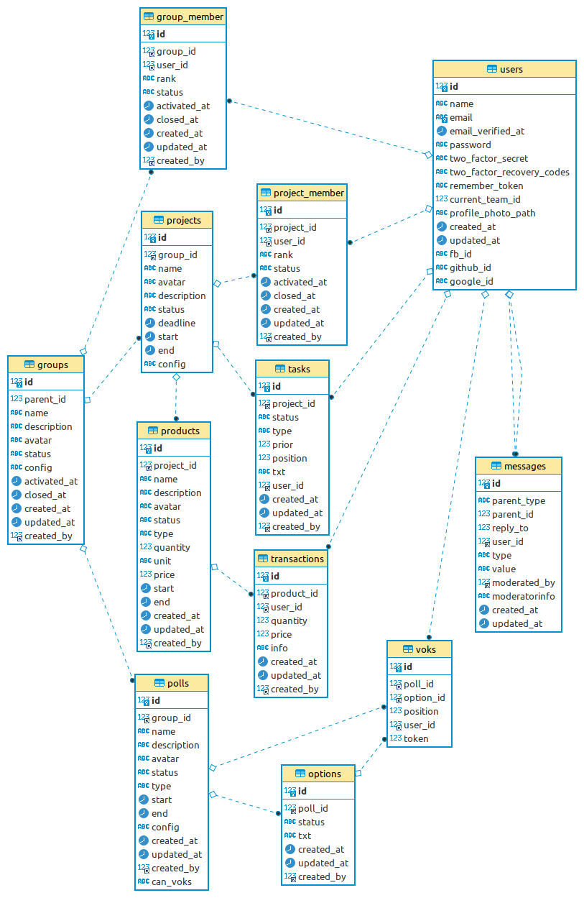

#Rekord kapcsolatok

				
- A "groups" és a "messages" fa szerkezetü (parent_id mező van bennük).
- "messages" kapcsolódhat groups, group_members, projects, project_members,
	             tasks, products, transactions, polls, voks, users rekordokhoz
- A "messages" tárolja a like/dislák és grade adatokat is. 				
- Több rekordban van "created_by" mező, ami users -re mutat (ez az ábrán nincs jelölve).
- a group_members és projekt_members táblákban egy user egy csoporthoz többször is szereplhet
(egy csoportban több tisztsége is lehet pl: member + admin + moderátor)
- A "groups" "config" mezőben json string formában egy objektum van, ebben van többek között a
csoport tisztségek felsorolás pl:  ranks:["member", "admin", "moderator"],
a "polls" "can_voks" mezőben egy elem van megadva ebből a ranks listából - azok szavazhatnak
akik a ezzel a "rank" -el rendelkeznek az adott csoportban.
- A részletes rekord leírásokat lásd a database/migration/*.php -fájlokban.

